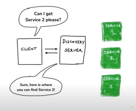
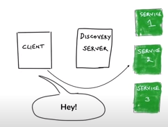

* [Service Discovery](#service-discovery)
* [Microservice configurationy](#microservice-configuration)

# Service Discovery
Instead of hardcoding URL of the service we consume, our microservice will check with the **Discovery Service** for available instance of service we looking for.<br>

**Why hard Coded URLs are so bad?**<br>
* URL changes requires code update.
* Dynamic URLs in the cloud
* Load Balancing
* Multiple Environment<br><br>

**Service Discovery Pattern**<br>
**Eureka Server** from Spring Cloud uses **Client Side Discovery**.When making a request to a service, the client obtains the location of a service instance by querying a Service Registry, which knows the locations of all service instances.Load balancing is handled in client side<br>
 <br>
 <br>

## Service Discovery Demo 
**[Eureka Server](service-discovery/discovery-server)**<br>
Create a project adding the starter **org.springframework.cloud:spring-cloud-starter-netflix-eureka-server** and add **@EnableEurekaServer** to application class.Now your Eureka server is ready to launch
* http://localhost:8761/
```
Create a server using below starter
	org.springframework.cloud:spring-cloud-starter-netflix-eureka-server
Props
	eureka.client.register-with-eureka=false 
	eureka.client.fetch-registry=false
	
@EnableEurekaServer
@SpringBootApplication
public class DiscoveryServerApplication {

	public static void main(String[] args) {
		SpringApplication.run(DiscoveryServerApplication.class, args);
	}

}
```
**[Eureka Discovery Client: Service Provider](service-discovery/ratings-data-service)**<br>
* Add starter **org.springframework.cloud:spring-cloud-starter-netflix-eureka-client** to your project
* Define appname in **application.properties**
* Addling **@EnableDiscoveryClient** is optional in latest spring cloud.
* http://localhost:8083/ratingsdata/users/2
```
Add below starter to app
	org.springframework.cloud:spring-cloud-starter-netflix-eureka-client	
Add App Name:
	spring.application.name=ratings-data-service
```
**[Eureka Discovery Client: Service Consumer](service-discovery/movie-catalog-service)**<br>
* Add starter **org.springframework.cloud:spring-cloud-starter-netflix-eureka-client** to your project.
* Define  appname in **application.properties**.
* Addling **@EnableDiscoveryClient** is optional in latest spring cloud.
* Add **@LoadBalanced** at **restTemplate** bean
* Use service name in api call instead of host **http://RATINGS-DATA-SERVICE/ratingsdata/users/"+userId**
* http://localhost:8081/catalog/1
```
Add below starter to app
	org.springframework.cloud:spring-cloud-starter-netflix-eureka-client	
	
Add App Name:
	spring.application.name=movie-catalog-service
	
Add @LoadBalance to rest template
	@LoadBalanced
	@Bean
	public RestTemplate setRestTemplate() {
		return new RestTemplate();
	}
Use app name in service call
 	restTemplte.getForObject("http://RATINGS-DATA-SERVICE/ratingsdata/users/"+userId, UserRatings.class);
```
# Microservice configuration
**Configuration Goals**
* Externalized - configuration separated from code(in props)
* Environment Specific - Profile
* Consistent - Consistent across all the service and there instance
* Version HISTORY
* Real-time management - changing config without restart

## [Read config from props file Demo](configurationy/config-at_value-configurationproperties)
**@Value annotation**
* @value  resolves the expression to a string
```
	Below code assigns the string value to variable.
	@Value("HelloWorld")
	private String staticHello;
```
* Read value from property file
```
@Value("${app.name}")
private String appName;
```
* **${} can be used with in property** file also
```
app.name=microservice-configuration
app.welcome.msg=Welcome tp ${app.name}
```
* **Read the property if not found assign default value**, default should be string
```
@Value("${concat.msg: from }")
private String concatMsg;
```
* **List from property file**
```
application.prop`
	myapp.consumer.lst=app1,app7,app8
	
@Value("${myapp.consumer.lst}")
private List<String> consumeList;
```
* **Map from property file**
```
application.prop`
	DB_BOOTSTRAP_CREDENTIALS = {db_host: "http://abc.com:3306",username: "tmp",password: "xxxx"}
	
@Value("#{${DB_BOOTSTRAP_CREDENTIALS}}")
private Map<String,String> dbCredentials;
```
* **ConfigurationProperties: resolve group of properties as bean(object)**
```
application.properties
	myapp.clientid=client_4321
	myapp.clientsecret=xyzxyzxyzxyzxyzxyz
	myapp.tokenurl=https://tokenurl/auth
	
@Configuration
//Property group stat myapp has to configured as below
@ConfigurationProperties("myapp")
public class MyAppClient {
	
	private String clientId;
	private String clientSecret;
	private String tokenURL;
}

@RequestMapping("/hello")
@RestController
public class HelloResource {
	@Autowired
	private MyAppClient client;
	@GetMapping
	public String hello() {
		return client.toString();
	}
}
```
1. Accessing Service using Febin client proxy
----------------------------------------------

	Create Provider (01_limits_msg_provider)
	----------------------------------------
		1. Create service with following starter
		   Spring Web
		   Service Registry PCF
		
		2. Provide end point /getmsg which returns 
			Welcome message with ip address in PCF and port in local
			
		3. Define in app name it is as part of froxy client in consumer side
			IT IS REQUIRED ONLY INCASE OF FEIGN CLIEN OR EUREKA REGISTORY
			spring.application.name=limits-msg-provider

	FEIGN CLIENT : Create Client (02_limits_Service_feign)
	----------------------------------------
		1. Create service with following starter
		   Spring Web
		   Feign client		 
		   lombok
		   Service Registry PCF
		   
		2. Provide endpoint for /limits
			return min,max,dummy msg
		
		3. Write proxy client for 01_limits_msg_provider 
			
			@FeignClient(name = "limits-msg-provider",url = "localhost:8000")
			public interface LimitsMsgProviderFeignProxyClient {
				@GetMapping("/getmsg")
				public String getMsg();
			}

		4. Enable Feign clients in Boot App java file
			@EnableFeignClients(basePackages ="com.practice.raja.microservice.limits.proxyclient" )
			
		5. Autowire proxy client in controller
		
		6. Get message from 01_limits_msg_provider using proxy client
		
		7. Define in app name it is as part of froxy client in consumer side
			IT IS REQUIRED ONLY INCASE OF FEIGN CLIEN OR EUREKA REGISTORY
			spring.application.name=limits-msg-provider
			
	RIBBON CLIENT SIDE LOAD BALANCING: Create Client (03_limits_Service_ribbon)
	--------------------------------------------------------------------------
		1. Create service with following starter
		   Spring Web
		   Feign client	
		   RIBBON
		   lombok
		   Service Registry PCF
		   
		2. Provide endpoint for /limits
			return min,max,dummy msg
		
		3. RIBBON LOAD BALANCING: Write proxy client for 01_limits_msg_provider with 
			
			@FeignClient(name = "limits-msg-provider")
			@RibbonClient(name = "limits-msg-provider")
			public interface LimitsMsgProviderFeignProxyClient {
				@GetMapping("/getmsg")
				public String getMsg();
			}
			
		4.	Configure list of client instanc in application.properties
			limits-msg-provider.ribbon.listOfServers=http://localhost:8000,http://localhost:8001
			
		5. Enable Feign clients in Boot App java file
			@EnableFeignClients(basePackages ="com.practice.raja.microservice.limits.proxyclient" )
			
		6. Autowire proxy client in controller
		
		7. Get message from 01_limits_msg_provider using proxy client
		
		8. Define in app name it is as part of froxy client in consumer side
			IT IS REQUIRED ONLY INCASE OF EUREKA REGISTORY
			spring.application.name=limits-service

2. Eureka Service Registory
---------------------------

	Create Eureka Naming Server (04_limits-eureka-netflix-naming-server)
	--------------------------------------------------------------------
		1. Create boot app with following starter
		   Eureka Server	   	

		2. Make this app as Eureka server by doing following
		       *application.properties
			       spring.application.name=limits-eureka-netflix-naming-server
			       eureka.client.register-with-eureka=false
			       eureka.client.fetch-registry=false

			*Application.java
				@EnableEurekaServer

		* We need this Naming Server application only in local. In PCF we can get this as service.
		* We have to find the service with both 05_limits_msg_provider_eureka and 06_limits_Service_eureka
		* Other configurations in application.property file will be reconfigured using AutoReconfiguration future.

	Create Provider (05_limits_msg_provider_eureka)
	----------------------------------------
		1. Create service with following starter
		   Spring Web
		   Service Registry PCF
		
		2. Provide end point /getmsg which returns 
			Welcome message with ip address in PCF and port in local
			
		3. Registoring service with Eureke
		        Defile app-name in application.props and define Eureke server url
				spring.application.name=limits-msg-provider
				eureka.client.service-url.defaultZone=http://localhost:8761/eureka
			Make Service discoverable using anotation
				@EnableDiscoveryClient -->Application.java
				
		4. Now go and check in Eureka Server localhost:8761 you will be able to see the app
		
	Create Client (06_limits_Service_eureka)
	----------------------------------------
		1. Create service with following starter
		   Spring Web
		   Feign client	
		   RIBBON
		   lombok
		   Service Registry PCF

		2. Provide endpoint for /limits
			return min,max,dummy msg

		3. RIBBON LOAD BALANCING: Write proxy client for 01_limits_msg_provider with 

			@FeignClient(name = "limits-msg-provider")
			@RibbonClient(name = "limits-msg-provider")
			public interface LimitsMsgProviderFeignProxyClient {
				@GetMapping("/getmsg")
				public String getMsg();
			}

		4. Enable Feign clients in Boot App java file
			@EnableFeignClients(basePackages ="com.practice.raja.microservice.limits.proxyclient" )

		5. Autowire proxy client in controller

		6. Get message from 01_limits_msg_provider using proxy client

		7. Registoring service with Eureke
				Defile app-name in application.props and define Eureke server url
					spring.application.name=limits-msg-service
					eureka.client.service-url.defaultZone=http://localhost:8761/eureka
				Make Service discoverable using anotation
					@EnableDiscoveryClient -->Application.java

		8. Now go and check in Eureka Server localhost:8761 you will be able to see the app

		9. Run more than one instance of 05_limits_msg_provider_eureka and call http://localhost:8300/limits 
			now ribben dinamically get the list of instance from Eureka we dont need to hardcode.
			
3. Resilience4j
---------------
	https://resilience4j.readme.io/docs/getting-started-3
	
	Resilient4j is a lightweight falult tolerance library inspired by Netflix Hystrix but designed for functional programing
	
	Vavr -javaslang
	
	Resilient4j provides higher order functions (decorators) to enhance any Functional Insterface,Lambda Expression or method refference with
		-Circuit Breaker
		-Rate Limiter
		-Retry
		-Bulkhead
	
	Circuit Breaker
	---------------
		CLOSED 		-> All fine service provider is up and running
		OPEN		-> Provider is down
		HALF-OPEN	-> Some hits are success some are failure				 
		
		* If circuit breaker is open it will not go to closed stated imediatly after first success request, first it will move to half open state then after some time it will move to closed state.
		
	Create Client (07_limits_service_resilience4j)
	----------------------------------------------

		Circuit Breaker
		---------------
			1. Create service with following starter
			   Spring Web
			   Feign client		 
			   lombok
			   Resilience4j spring boot starter (it intenally requires AOP and ACTUATOR)
				io.github.resilience4j:resilience4j-spring-boot2	   


			2. Provide endpoint for /limits
				return min,max,dummy msg
				Verify the flow

			3. Write proxy client for 01_limits_msg_provider 

				@FeignClient(name = "limits-msg-provider",url = "localhost:8000")
				public interface LimitsMsgProviderFeignProxyClient {
					@GetMapping("/getmsg")
					public String getMsg();
				}

			4. Enable Feign clients in Boot App java file
				@EnableFeignClients(basePackages ="com.practice.raja.microservice.limits.proxyclient" )

			5. Create Service Layer to handle service call LimitsResilienceImpl

				*Autowire proxy client in controller
				*create getMsg -> call service and return msg msgProviderProxy.getMsg()
				*create getFallbackMsg(Throwable throwable) -> retun static string
					it will be used in circuit breaker when need to fall back

			6. Autowire LimitsResilienceImpl in controller	

				*Get message from 01_limits_msg_provider by calling LimitsResilienceImpl-> getMsg
				*Verify the flow

			7. Configure CircuitBreaker in Service Layer (LimitsResilienceImpl)

				*add @CircuitBreaker(name = "getMsgCrkBrkr", fallbackMethod = "getFallbackMsg") on top off get Msg method.
				now if the msg provider service is down fallbackMethod method will be called

			8.Custom Circuit Breaker config
			-------------------------------
				Above will work as per default config, we can customize Circuit Breaker configuration as per our need.
			    * it is better to use yaml file instead of .properties so change the file extention

				application.yml
				---------------
				spring:
				  application:
					name: limits-service

				server:
				  port: 8300 

				resilience4j:
				  circuitbreaker:
					instances:
					  getMsgCrkBrkr: # it is the name given in Circuit Breaker annotaion (@CircuitBreaker(name = "getMsgCrkBrkr", fallbackMethod = "getFallbackMsg"))
						register-health-indicator: true
						ring-buffer-size-in-closed-state: 5
						ring-buffer-size-in-half-open-state: 3
						wait-duration-in-open-state: 10s
						failure-rate-threshold: 10          

			9. Actutator CircuitBreaker Configuration
			-----------------------------------------
				*BY DOING BELOW CONFIGURATION WE CAN SEE CIRCUIT BREAKER STATE AND OTHER DETAILS IN ACTUTATOR HEALTH PAGE

				management.endpoint.health.show-details: always
				management.endpoints.web.exposure.include: "*"  
				management.health.circuitbreakers.enabled: true

				check CircuitBreaker status in health url
				http://localhost:8300/actuator/health
				
	RATE LIMITER
	------------
		CONTROL NO OF REQUEST SENT TO AN APPLICATION
		
		timeoutDuration  	5 [s]     The default wait time a thread waits for a permission
		limitRefreshPeriod	500[ns]	  The period of a limit refresh. After each period the rate limiter sets its permissions count back to the limitForPeriod value	
		limitForPeriod		50	  The number of permissions available during one limit refresh period
		
		  ratelimiter:
		    instances:
		       getMsgSrvce: # it is the name given in Rate Limiterr annotaion @RateLimiter(name = "getMsgSrvce")
			limitForPeriod: 10
			limitRefreshPeriod: 500
			timeoutDuration: 5
	BULK HEAD
	---------
		BY USING BULK HEAD WE CAN LIMIT THE NO OF CONCURRENT CALLS TO A PARTICULAR SERVICE.
		
	RETRY
	-----
		RETRY WILL TRY TO CONNECT TO THE SERVICE IN SPECIFIC NO OF TIME ON SPECIFIC DURATION EVEN IF THE SERVICE IS NOT ACCESSIBLE .BEFORE RETURNING THE RESPONSE.
		
		With below config service will be called 6 times on 10000ms interval before returning the value.In case of service is up and running it will call just one time and respond.
		
		retry:
		 instances:
		  getMsgSrvce:
		    max-retry-attempts: 6
		    wait-duration: 10000
